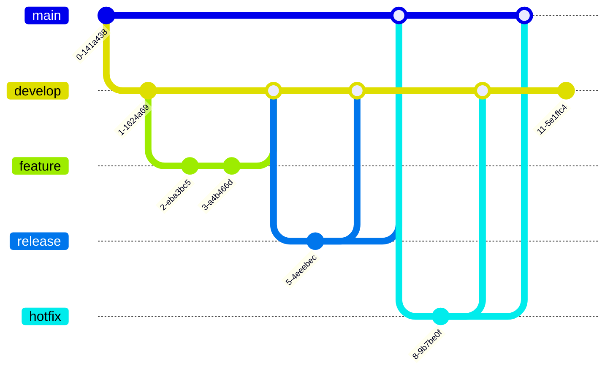

## If statement in one line python
```python
value_when_true if condition else value_when_false
```

**Examples Duplicate Encoder:**
```python
def duplicate_encode(word):
    word = word.lower()
    return ''.join(['(' if word.count(letter) == 1 else ')' for letter in word])
```

---

## Javascript naming convention

```javascript
function get[element]Array() {}
function set[element]() {}
function get[element]PlaceHolderHtml () {}
function render[element]() {}
```

---

## Graph of Git flow

**Git flow graph**



**Tag naming convention:**

- `v` - version
- `b` - build
- `r` - release
- `h` - hotfix

```bash
v0.1.0
v<major>.<minor>.<patch>
```

---
