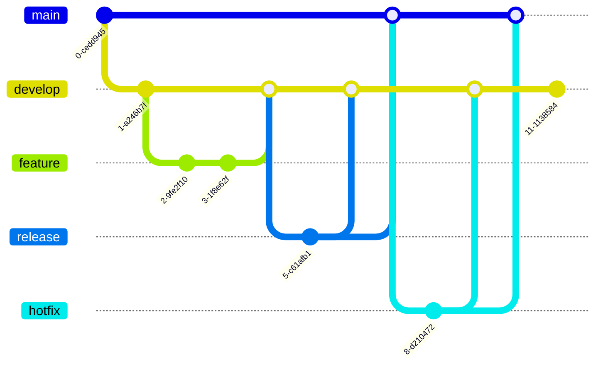

## Graph of Git flow

**Git flow graph**


**Tag naming convention:**
```bash
v0.1.0
v<major>.<minor>.<patch>
```

---

## Use Git Large File Storage

For large files, [git-fls](https://git-lfs.github.com/) is a good solution.

  
  ```bash
  brew instal git-lfs
  ```
  
